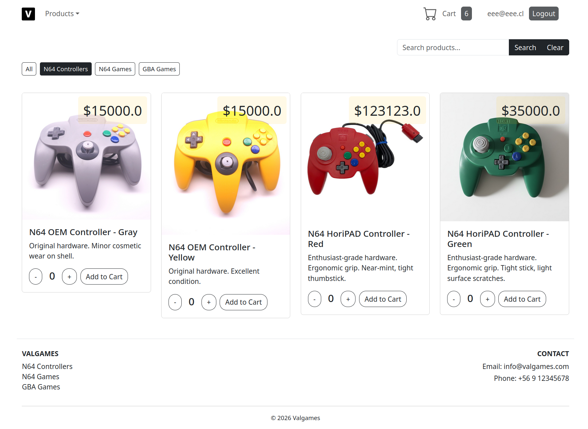
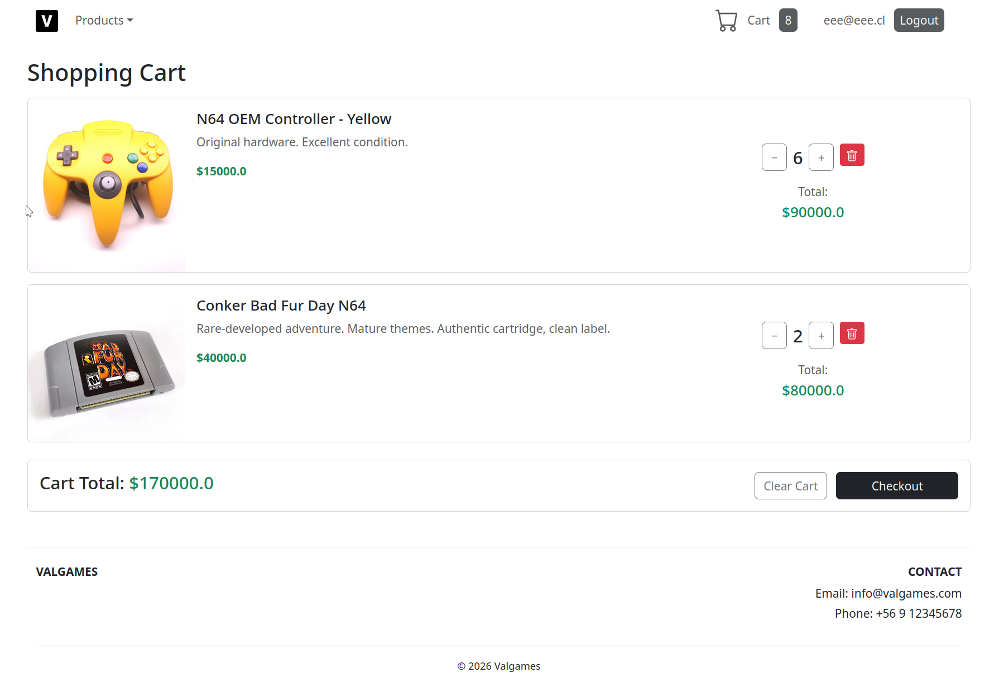
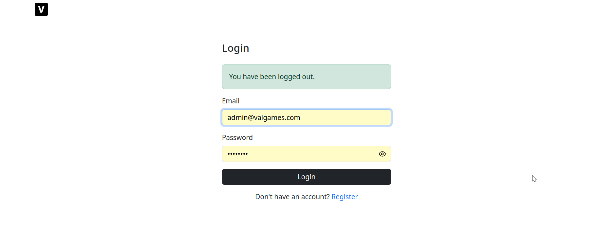
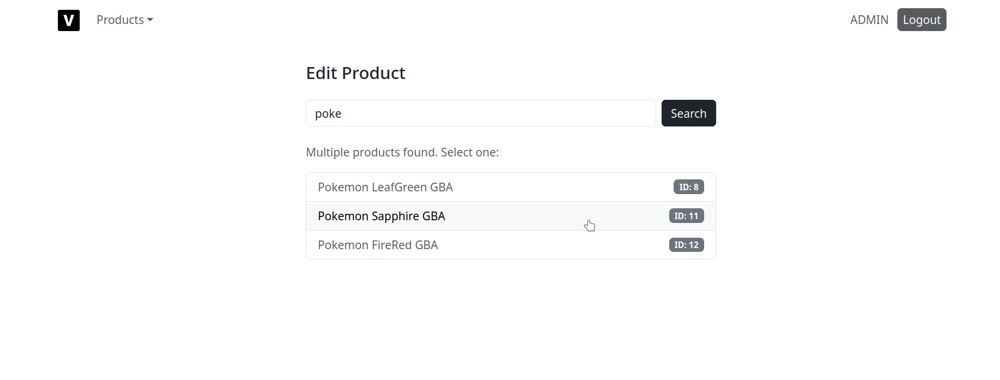
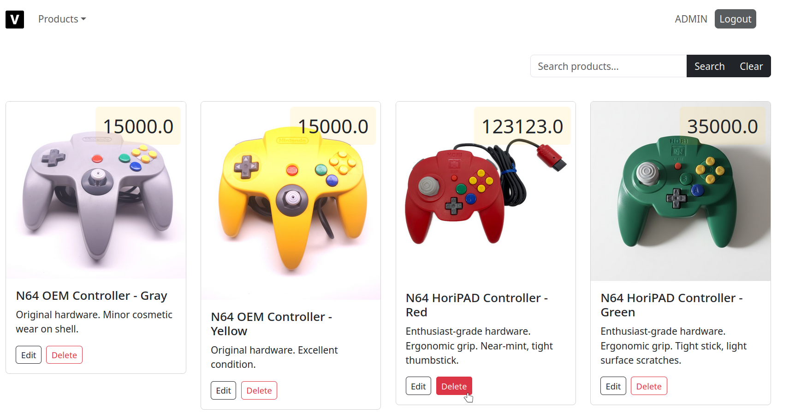

# Valgames ecommerce

Spring implementation of a retro games and controllers ecommerce, including roles, basic CRUD, Cart session memory and registration.

## Instructions for usage

1. Run `schema.sql` (includes all queries for creating, selecting and feeding an schema)
2. Update `src/main/resources/application.properties` with your MySQL/mariadb credentials in your machine
3. A default (modifiable) admin account is included (user: admin@valgames.com, password: SuperPassword64), for a client account you can create one (^_~) it's easy
4. If needed, implement MySQL dependencies on `pom.xml`, since implementation was done with mariadb in consideration

## Run

```bash
mvn spring-boot:run
```

or simply Run Main.java on your IDE of choice

## Predefined Paths 

 `/`  Public (landing page) 
 
 `/login`  Public 
 
 `/register`  Public 
 
 `/catalog`  Authenticated (client or admin) 
 
 `/admin/products/*`  Admin only


## Roles
- **CLIENT** → redirected to `/catalog`
- **ADMIN** → redirected to `/admin/products`

## Considerations and to-do's

- If wanted to add a new product, check the id of the new product at the time of creation and add it to `src/main/resources/static/img/` named as `{product_id}.png` (proper file addition is WIP)
- Trying to access admin paths being Authenticated clients will result in error instead of redirecting to catalog or landing page (WIP, haven't figured out)
- LLMs usage kept to the minimum, primarily used for formatting and giving structure to htmls, and certain SpringSecurity concerns (paths, sessions)
- There's some vertical displacement in front-end for products when description is too short, due to time concerns this is WIP (carried from front-end module implemented here)
- Proper Server side Cache/DB storage of Carts, for multiplatform/device Cart retention, since right now is held in *Session*

## Screenshots







